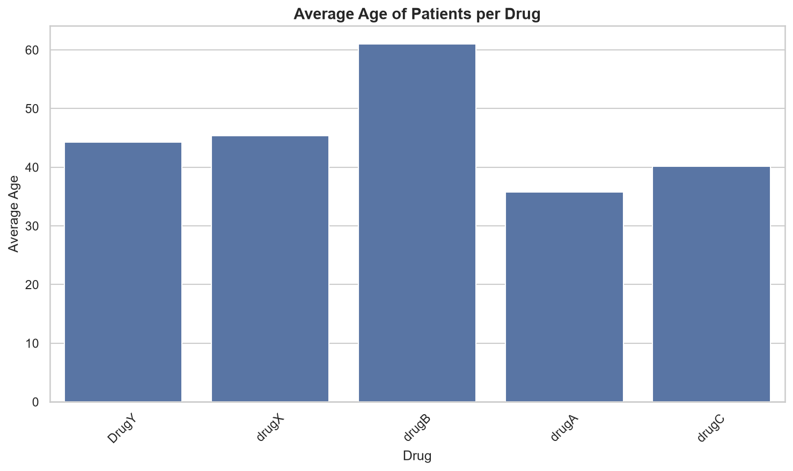
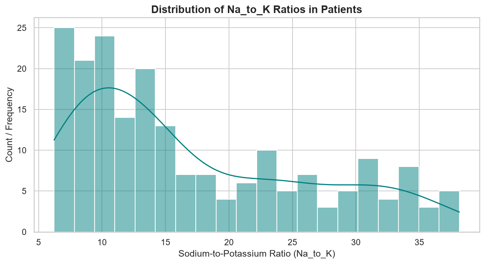

<h1 align="center">💊 Pharmacy EDA</h1>

<p align="center">
  <b>Exploring Drug Prescription Patterns in a Sample Patient Dataset</b>
</p>

<p align="center">
  
  
  
  
  
</p>

> ⚠️ **Educational project.** This analysis uses a synthetic learning dataset. It is not clinical evidence and must not be used for patient care.

## 📑 Table of Contents

- [Description](#-description)
- [Dataset](#-dataset)
- [Questions Explored](#-questions-explored)
- [Methods](#-methods)
- [Key Findings](#-key-findings)
- [Limitations](#-limitations)
- [How to Run](#-how-to-run)
- [Tools](#-tools)

## 📖 Description

This project is an exploratory data analysis (EDA) of a public drug classification dataset. It is the **first step of a four-week project** that combines PharmD training with data science.

The aim is to become comfortable cleaning, exploring, and visualizing patient and drug data in Python before any modelling is done.

## 🗂️ Dataset

`drug200.csv` contains **200 patient records** with the following columns:

| Column | Description |
| --- | --- |
| `Age` | Patient age in years |
| `Sex` | Patient sex |
| `BP` | Blood pressure level |
| `Cholesterol` | Cholesterol level |
| `Na_to_K` | Sodium-to-potassium ratio |
| `Drug` | The drug assigned |

> The dataset is synthetic, so it does not represent real prescribing data.

## ❓ Questions Explored

1. Which drug is most common among patients with **HIGH** blood pressure?
2. How does average age differ across drug groups?
3. How is the sodium-to-potassium ratio distributed, and does it separate any drug group?

## 🔬 Methods

- **Load and inspect** the data with pandas (shape, data types, missing values, summary statistics).
- **Group and count** records to answer the blood pressure question.
- **Visualize** average age per drug and the `Na_to_K` distribution with seaborn.

## 📊 Key Findings

### 1. Most Common Drug for High BP Patients
* **DrugY** is the most frequent medication prescribed to patients with **HIGH** blood pressure, appearing **29 times** in the dataset.
* **DrugA** (23 times) and **drugB** (20 times) are also commonly prescribed for high blood pressure conditions.


### 2. Average Age per Drug Group
* **Drug B** has the highest average patient age at **61.0 years**.
* **Drug A** has the lowest average patient age at **35.7 years**.
* The remaining drugs (Drug C, Drug X, and Drug Y) cluster cleanly in the **40 to 45 year** age bracket.
  


### 3. Na_to_K Ratio is a Defining Threshold
* The distribution curve reveals that the **Sodium-to-Potassium (Na_to_K) ratio** is the single most critical factor for **Drug Y**.
* Every single patient with an `Na_to_K` ratio **greater than 15.0** is strictly prescribed **Drug Y**, regardless of age, sex, or blood pressure levels.




## 🚧 Limitations

- The data is **synthetic and small**, so patterns are illustrative only.
- **No statistical testing** was done; findings are descriptive.
- The analysis is **not clinical evidence** and must not be used for patient care.

## 🚀 How to Run

```bash
git clone https://github.com/emmydenco/pharmacy-eda.git
cd pharmacy-eda
pip install pandas seaborn matplotlib jupyter
jupyter notebook
```

Then open the notebook and run the cells from top to bottom.

## 🧰 Tools

Python · pandas · seaborn · matplotlib · Jupyter Notebook

<p align="center">
  <sub>Part of a 4-week Pharmacy + AI learning project by Adebayo Denis Emmanuel, PharmD student, University of Ilorin. Built by Emmydenco™.</sub>
</p>
